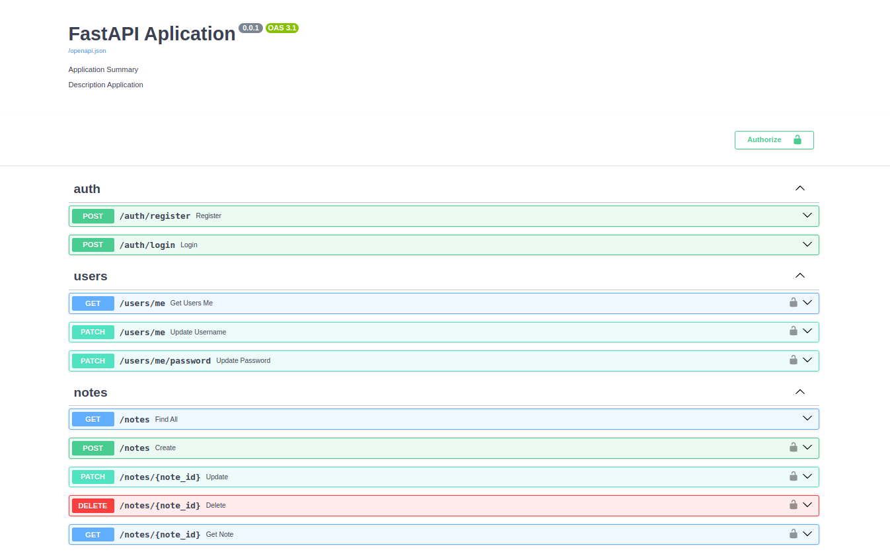

## FastAPI API Notes
**Описание:**
RESTAPI Заметок.

### 

### Запуск приложения
```shell
docker-compose up -d app db pgadmin
```

### Создать Миграции
```shell
docker-compose exec app yoyo apply

[20240227_01_RZqcd]
Shall I apply this migration? [Ynvdaqjk?]: y

Selected 1 migration:
  [20240227_01_RZqcd]
Apply this migration to postgresql://postgres:postgres@db:5432/postgres [Yn]: Y
```

### Отменить Миграции
```shell
docker-compose exec app yoyo rollback
```

### Запуск Тестов
```shell
docker-compose up tests test-db
```

### Зависимости
```
anyio==4.3.0
asyncpg==0.29.0
bcrypt==4.1.2
black==24.2.0
cryptography==42.0.5
fastapi==0.110.0
httpx==0.27.0
passlib==1.7.4
psycopg2-binary==2.9.9
pydantic==2.6.2
pydantic-settings==2.2.1
pytest==7.3.1
pytest-asyncio==0.21.0
python-dotenv==1.0.0
python-jose==3.3.0
SQLAlchemy==2.0.27
uvicorn==0.27.1
yoyo-migrations==8.2.0
```

### Python version: ```3.11.8```